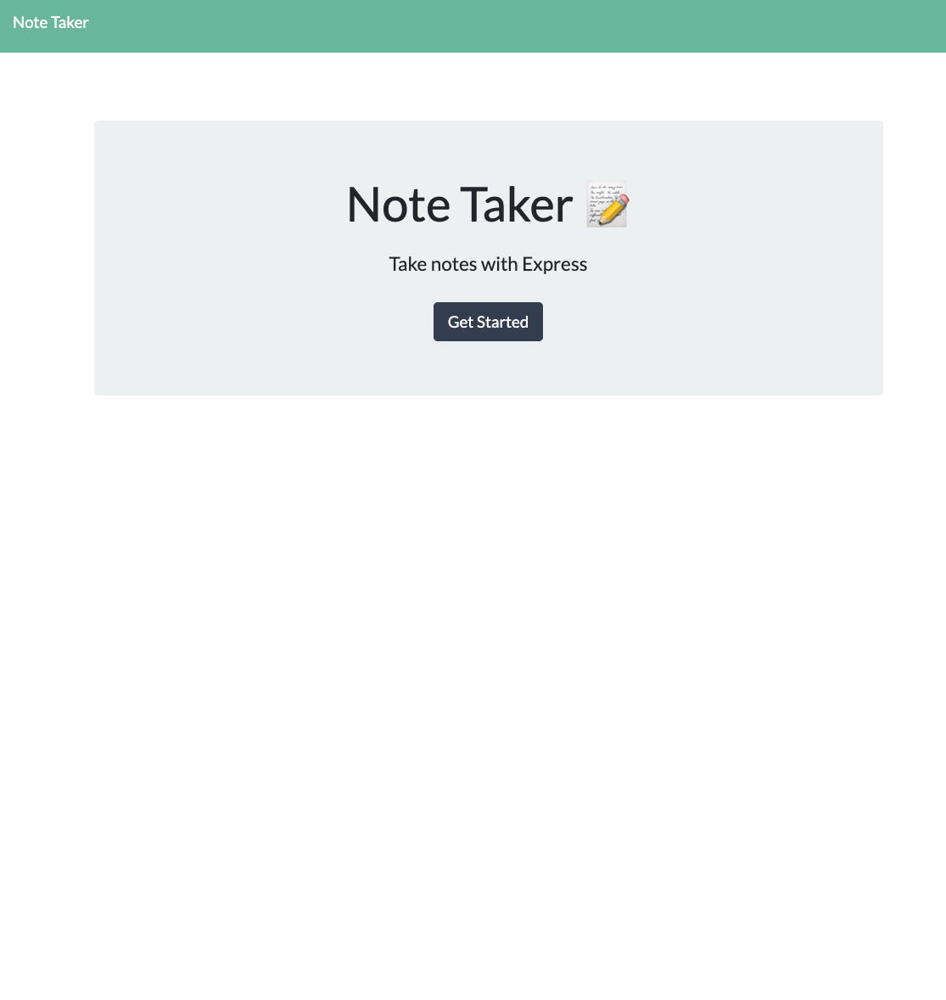

  # Title
  Note Taker

 ## Description
 For this project, This is an application that allows you to write down notes that's saved on the left side of the application where you can save for later or delete if you choose. On the right-side of the application is where you will create a title and write down the body of the note.

 ## Table of Content
 | [Installation](#installation) |
 [Usage](#usage) |
 [Credits](#credits) |
 [License](#license) |
 [Badges](#badges) |
 [Feature](#features) |
 [contributors](#contributors) |
 [test](#test) |

 ## Installation
 You'll run "npm i", and then "npm start" and the local server will run the application. Another way to get this app deployed is to access it through the heruko app.

 ## Usage
 

 ## Credits
 [my Github:](https://www.github.com/Grady253).
 [My email:](mailto:Grady.andre2@gmail.com).

 ## Instructions
 You'll click the "Get Started" button on the front page, which will then transfer you to the page where the user will be able to write down notes and save them. Also, you'll have the choice to delete old notes as well.

 ## License
 
    This project is under N/A.
 

 ## Badges
 

 ## Test

 ## Questions
 